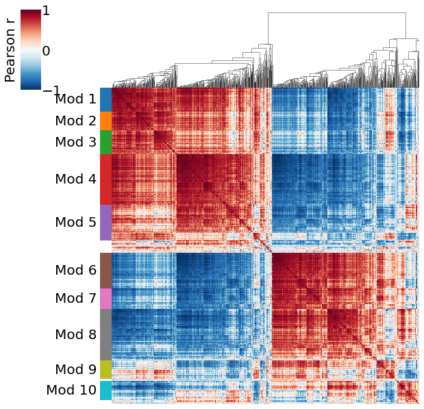

# Psix

Psix is a computational tool for identifying cell-state associated alternative splicing events in single cell RNA-seq (scRNA-seq) data.

Inspired by autocorrelation approaches, Psix will tell you if an exon's splicing is significantly associated with a cell metric that shows the relationships between single cells. In practice, this map could be a low-dimensional representation of the gene expression of a single cell population. Psix also identified modules of potentially co-regulated exons.

[Coverage dependent biases](https://elifesciences.org/articles/54603) add unwanted technical variation to splicing observations in single cells. Psix uses a probabilistic approach to fit two models for each exon: 

* Model 1: exon usage is cell-state associated. Under this model, each cell's  is more likely to be similar to the average of it's neighbors, than to the global average.
* Model 2: exon usage is independent of cell state. Under this model, each cell's  is equally likely to be similar to the average of its neighbors, than to the global average.

By comparing the probability of the observations given each model, Psix estimates a score. The higher the  score of an exon, the more confident we are that the exon is cell-state associated.

<ADD LINKS TO EXAMPLES, INCLUDING FOR THE PAPER, HERE>

## Installation

Psix is a Python module and it requires Python version 3.6 or higher. Psix is installed directly from github using the following command:

```
pip install git+https://github.com/lareaulab/psix.git
```

Missing package dependencies will be automatically installed.

## Psix input

##### 1. SJ.out.tab files

We recommend mapping raw scRNA-seq reads using STAR version 2.5.3a. Psix uses the ```SJ.out.tab``` files from the STAR aligner. Individual files from each single cell should be stored in the same directory with the following naming format: ```cellID.SJ.out.tab```. The files can be gzipped or uncompressed. If you are using STARsolo, go to **Running Psix with STARsolo**.

##### 2. TPM matrix for smart-seq2 only

The TPM matrix of **gene** expression can be obtained running different methods. We use RSEM version  1.2.31 because it can be run using STAR as the aligner. Other methods such as Kallisto can also be used to generate this matrix. This is only required for smart-seq2 data. Go to **Running Psix in UMI data** to see .

##### 3. Low-dimensional cell space

A low-dimensional cell space is provided by the user, since Psix does not perform dimensionality reduction. In principle Psix can run with any metric. However, we recommend using interpretable dimensionality reduction methods such as PCA over the normalized gene expression, while avoiding non-interpretable methods such as tSNE except for visualization. 

For small smart-seq2 datasets (fewer than 5000 cells), we recommend using SCONE to select the best normalization method before applying a linear dimensionality reduction such as PCA. Alternatively, other methods such as ZINB-Wave can be used on this data. For larger datasets, we recommend using the latent space of scVI as the low-dimensional cell space.

##### 4. Cassette exon annotation

This consists of a table specifying the location (chromosome, start and end) of splice junctions. Splice junctions are annotated as supporting the inclusion of a cassette exon (\_I1 and \_I2), supporting its exclusion (\_SE), or constitutive (\_CI). You can download ready-to-use mouse (mm10) and human (hg38) annotations [here](http://github.com/laeraulab/psix/annotations/). For creating your own cassette exon annotation, see **HERE INSERT LINK TO ANNOTATION PROCESSING**.

## Getting started

This section was written with smart-seq2 data in mind, but running Psix on UMI data is not much different. For the specifics on running Psix on UMI-based scRNA-seq data, go to **Running Psix in UMI data**.

Psix requires four inputs from the user:
* A directory containing SJ.out.tab files from STAR. This is used to calculate the exon's observed .
* A matrix of gene expression in transcripts per million (TPM; for smart-seq2 data only). This is used to estimate the captured mRNA molecules per observation.
* A low-dimensional cell space; e.g., a PCA projection of normalized gene expression. This is used to define cell neighborhoods.
* A cassette exon annotation of splice junctions. Ready-to-use mouse (mm10) and human (hg38) annotations are provided [here](http://github.com/laeraulab/psix/annotations/).

### Creating a Psix object with smart-seq2 data

You can import Psix and create a Psix object by running:

```python
import psix
psix_object = psix.Psix()
```


This will create an empty Psix object. To run Psix, we have to first calculate the observed  and estimate the number of mRNA molecules captured per observation. We can do that by simply running:


```python
psix_object.junctions2psi(
        sj_dir='/path/to/SJ_files/directory/',
        intron_file='/path/to/cassette_exon_annotation.tab',
        tpm_file='/path/to/gene_expression/tpm_file.tab',
        save_files_in='psix_output/'
    )
```

The optional argument ```save_files_in``` will create a directory where Psix will store the  and mRNA counts matrices for future use. Saving the files allows us to skip this step after running ```junctions2psi``` for the first time. This is done by specifying the location of the  and mRNA counts matrices when creating a Psix object:

```python
from psix import Psix
psix_object = Psix(psi_table = 'psix_output/psi.tab.gz',
                   mrna_table = 'psix_output/mrna.tab.gz')
```

### Getting cell-state associated exons

After creating a Psix object, we can obtain the Psix scores of each exon by running:

```python
psix_object.run_psix(latent='/path/to/low_dimensional_space.tab', 
                     n_random_exons=2000, 
                     n_neighbors=100
                     )
```


By default, Psix divides the exons into 25 sets according to their variance (five bins) and averge (five bins)  to calculate the empirical p-values. Estimating the empirical p-values of exons is the most time consuming step of Psix, specially in large datasets. To speed things up, you can run Psix in parallel simply by specifying the number of threads  by passing the argument ```n_jobs=t```.

The results of Psix can be found at ```psix_object.psix_results``` in the form of a dataframe with the following information:


Exon | psix_score | pvals | qvals
---- | ---- | ---- | ---- 
Mapt_1 | 2.709381 | 0.0005 | 0.001879
Ndrg4_1 | 2.359093 | 0.0005 | 0.001879
Dbn1_1 | 2.302729 | 0.0005 | 0.001879
Mapt_3 | 1.964202 | 0.0005 | 0.001879
Gabrg2_1 | 1.896363 | 0.0005 | 0.001879
... | ... | ... | ...


Notice that the empirical p-values are estimated with exon permutations. For this reason, the Psix score is a better value for ranking exons with very low p-values, than the p-values themselves.

### Modules of correlated exons

Psix can find modules of correlated exons by using the neighbor average  previously used for fitting the model in which an exon is cell-state associated. Using the neighbor average greatly reduces unwanted noise from the raw data. We can obtain these modules as follows:

```python
psix_object.compute_modules(plot = True)
```




The modules can be accessed in ```psix_object.modules```.

### Saving and loading a Psix object

We can save out Psix object for future uses. This will allow us to skip all the preprocessing, scoring and clustering steps. We can save out object by running the following command:
    

```python
psix_object.save_psix_object(psix_dir = 'psix_output')
```

This will create a directory named ```psix_output``` where it will store the Psix object. By default, Psix will not overwrite an existing Psix oject with the same name. If you want to overwrite an existing Psix object, you should use the ```overwrite=True``` argument when running ```save_psix_object```.

We can load an existing Psix object as follows:


```python
psix_object = psix.Psix(psix_object = 'psix_output')
```

## Runing Psix on STARsolo output

In progress...

## Runing Psix on UMI data

In progress...
